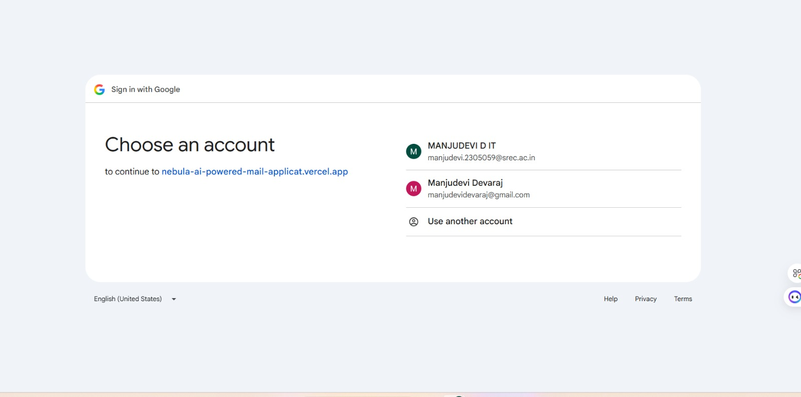
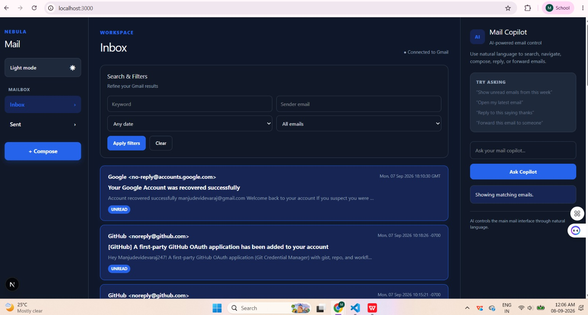
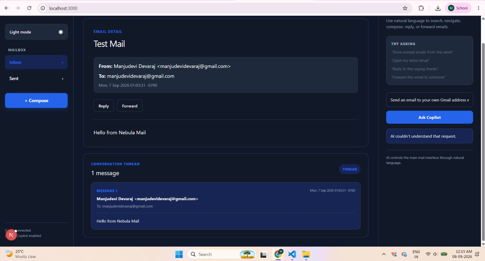
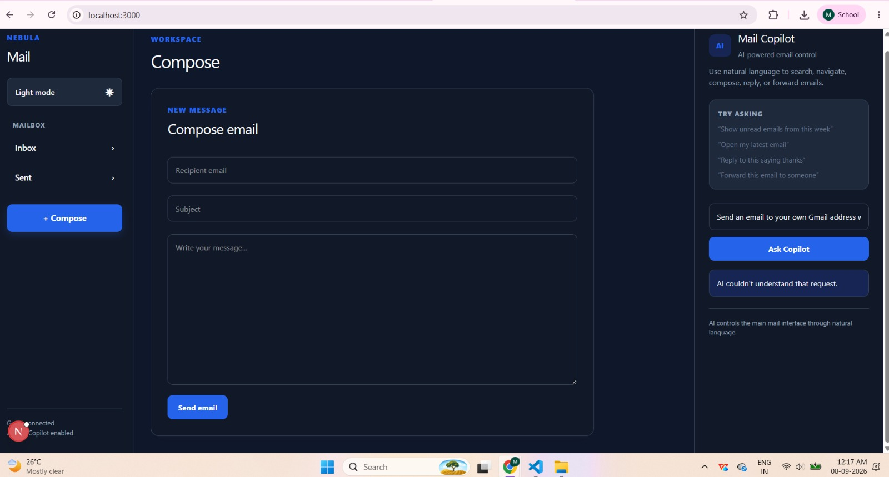
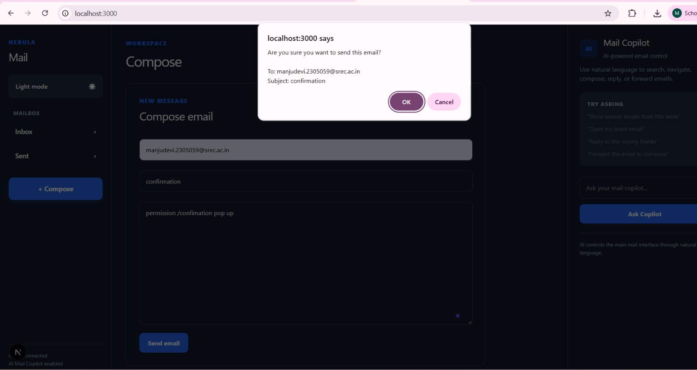
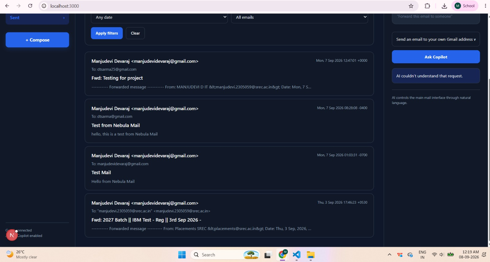
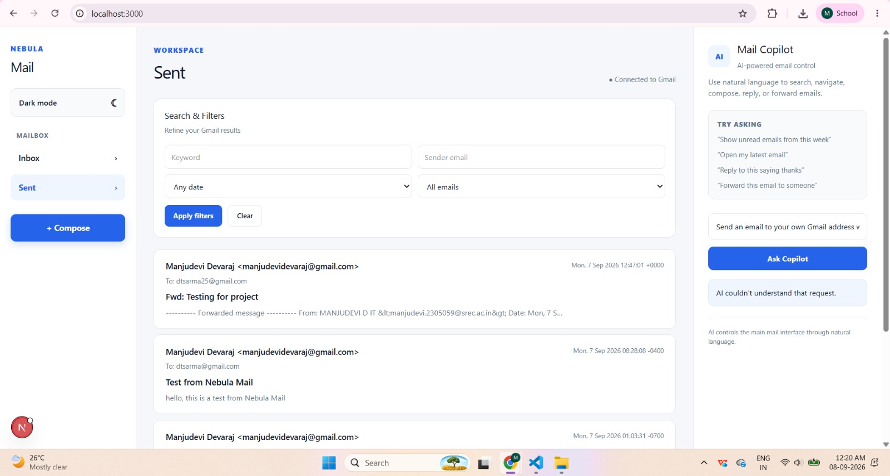

# Nebula AI Powered Mail Web Application

A Gmail-based web application built for the Nebula KnowLab Engineering Hiring Task.

The application connects to a real Gmail account and includes an AI assistant that understands natural-language requests and controls the mail interface.

## Features

* Google OAuth authentication
* Real Gmail Inbox and Sent mail
* Open, compose and send emails
* Reply and forward
* Read/unread emails
* Search and filters
* Email conversation threads
* Automatic mailbox refresh
* Dark mode
* Jest tests

## AI Assistant

The assistant is designed to control the UI, not just act as a chatbot.

Examples:

```text
Show me unread emails from this week
Open the latest email from David
Send an email to john@example.com
Reply to this
Forward this email
```

The assistant converts the request into an action and updates the main UI. It also uses the currently opened email as context for actions such as reply and forward.

## Architecture

```text
             User
              |
              v
        Next.js / React UI
          /           \
         v             v
      AI API       Gmail API
         |             |
         v             v
    UI Actions      Real Gmail
         |
         v
 Search / Compose / Reply /
 Forward / Open / Filter
```

* **UI:** Handles the mail interface.
* **AI:** Understands natural-language requests and returns actions.
* **Gmail Service:** Handles OAuth and Gmail API operations.
* **UI Actions:** Executes AI commands in the main interface.

## Architecture Decisions & Trade-offs

* Used **Gmail API** instead of mock data to work with real emails.
* Used **structured AI actions** so the AI decides the intent while the frontend controls the UI.
* Kept Gmail API operations on the **server side** to protect credentials.
* Used **periodic refresh** for mailbox updates. A persistent Gmail Pub/Sub consumer would be the next step for true push-based sync.

## Gmail Integration

The application uses:

* Google OAuth 2.0
* Gmail API
* Real Inbox and Sent data
* Gmail email details and threads
* Gmail send functionality

Sensitive credentials are stored in environment variables and excluded from Git.

## Screenshots / Demo

### Login



### Inbox



### Email Detail



### Compose Email



### Confirmation



### Sent Email



### Light Mode



### AI Driven UI by Filters


## Setup

### Requirements

* Node.js
* Google Cloud project
* Gmail API enabled
* Google OAuth credentials
* Gemini API key

### Run Locally

```bash
git clone https://github.com/Manjudevidevaraj247/Nebula-AI-Powered-Mail-Web-Application.git
cd Nebula-AI-Powered-Mail-Web-Application
npm install
npm run dev
```

Create a `.env.local` file with the required Google OAuth and Gemini credentials.

Then open:

```text
http://localhost:3000
```

## Testing

```bash
npm test
```

## What I Would Improve

* Replace polling with Gmail Pub/Sub push notifications
* Add pagination and attachment support
* Improve automated test coverage
* Improve AI error and rate-limit handling

## Deliverables

Private GitHub repository with:

* Clean commit history
* Setup instructions
* Architecture decisions and trade-offs
* Screenshots / demo
* Required collaborators:

  * Aswath363
  * akshaiP
  * ashwanthnebula

## Tech Stack

* Next.js
* React
* TypeScript
* Gmail API
* Google OAuth 2.0
* Google Generative AI
* Jest


## Live Demo

https://nebula-ai-powered-mail-applicat.vercel.app/

## Repository

https://github.com/Manjudevidevaraj247/Nebula-AI-Powered-Mail-Web-Application

Built for the Nebula KnowLab Engineering Hiring Task.
